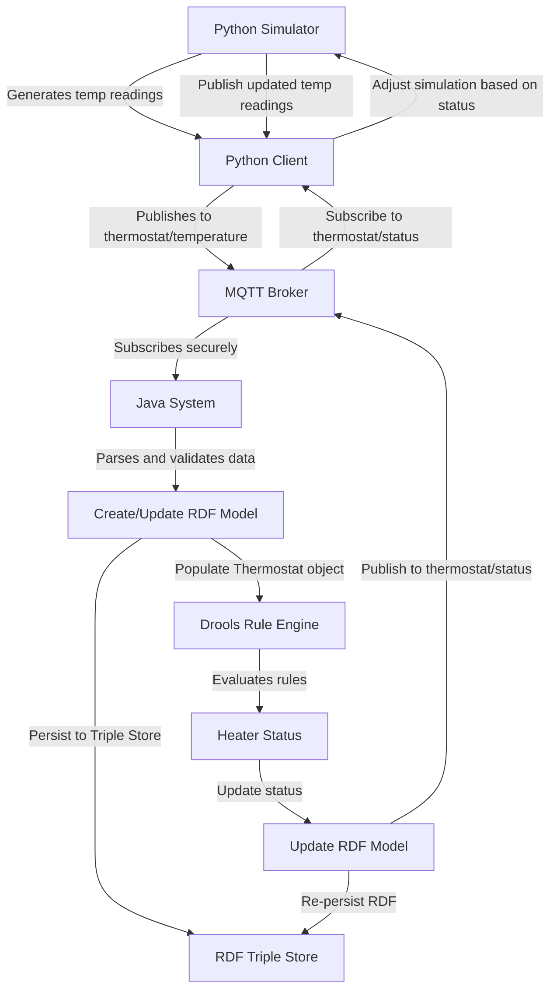

# IOT-RE

# NOTE:

The information about the implementation of the thermostat system including its logic and working is in the IOT_REPORT pdf file and the research behind our thought process and the motivation, future work and the things we learnt during this Reading Elective is in the ppt.

# Smart Thermostat System with MQTT and Drools

[](https://opensource.org/licenses/MIT)


An IoT system that simulates thermostat operation using MQTT for communication, Drools for rule-based decision making, and RDF for data persistence.

## Features

- **Real-time Temperature Monitoring**
- **Rule-based Heater Control** using Drools
- **MQTT Cloud Integration** (HiveMQ)
- **Semantic Data Storage** in RDF/Turtle format
- **Alert System** for temperature thresholds
- **W3C WoT-compliant** Thing Description

## Architecture



## Installation

1. **Clone the Repository**

   ```bash
   git clone https://github.com/KrishDave1/IOT-RE.git
   cd IOT-RE/thermostat
   ```

2. **Install Python Dependencies**
   ```bash
   pip install paho-mqtt
   ```

## Running the System

### Start Python Simulator

```bash
python thermostat.py
```

### Build and Run Java Controller

```bash
mvn clean package
mvn exec:java -Dexec.mainClass="com.iot.IoTThermostat"
```

## Key Components

### 1. MQTT Communication

- **Python Simulator** publishes temperature data every 10s to `thermostat/temperature`
- **Java Controller** subscribes and processes messages
- **QoS 1** for guaranteed delivery
- Secure TLS connection to HiveMQ Cloud

### 2. Drools Rules Engine

Rules defined in `rules.drl` control heater operations. Actual rules from the system:

```drl
package rules

import com.iot.Temperature
import com.iot.ThermostatState

rule "Turn on heater when cold"
    when
        $temp : Temperature(value < 18)
        $state : ThermostatState(heaterOn == false)
    then
        System.out.println("Temperature is cold (" + $temp.getValue() + "°C), turning heater ON");
        $state.setHeaterOn(true);
end

rule "Turn off heater when warm enough"
    when
        $temp : Temperature(value > 22)
        $state : ThermostatState(heaterOn == true)
    then
        System.out.println("Temperature is warm (" + $temp.getValue() + "°C), turning heater OFF");
        $state.setHeaterOn(false);
end
```

### 3. RDF Data Storage

The system persists operational data using semantic web technologies:

**Key Features:**

- Stores temperature readings with timestamps and heater states
- Uses Apache Jena framework for RDF processing
- Outputs data in Turtle format (.ttl) for human readability
- Creates semantic relationships between measurements
- Enables future SPARQL querying capabilities

**Example Data Structure:**

```turtle
<http://iot.org/thermostat/Reading/1744137385292>
        a       <http://iot.org/thermostat/TemperatureReading> ;
        <http://iot.org/thermostat/heaterState>
                true ;
        <http://iot.org/thermostat/timestamp>
                "1744137385292"^^<http://www.w3.org/2001/XMLSchema#long> ;
        <http://iot.org/thermostat/unit>
                "°C" ;
        <http://iot.org/thermostat/value>
                "19.06"^^<http://www.w3.org/2001/XMLSchema#double> .
```
