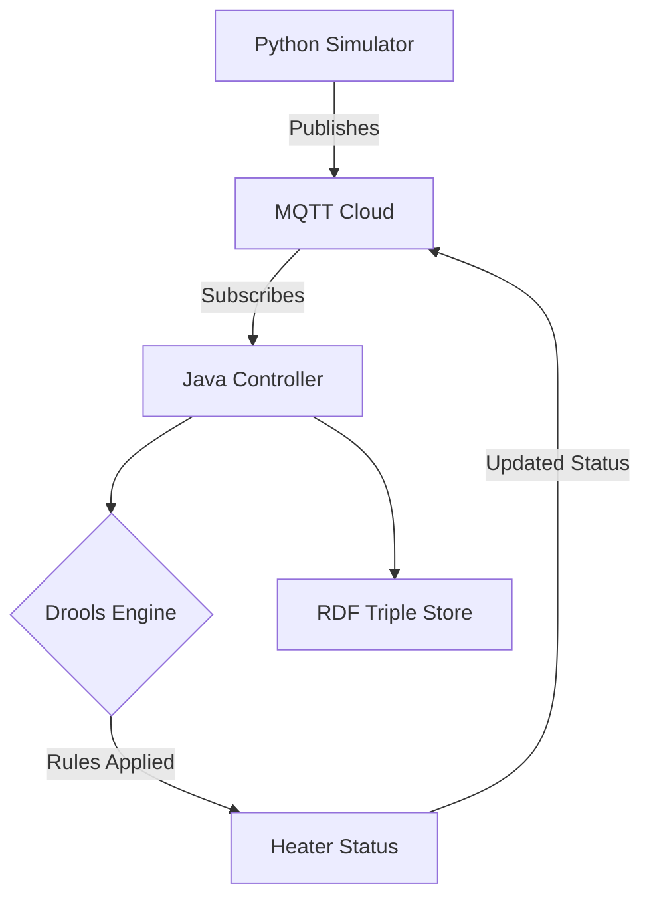

# IOT-RE

# Smart Thermostat System with MQTT and Drools

An IoT system that simulates thermostat operation using MQTT for communication, Drools for rule-based decision making, and RDF for data persistence.

## Features

- **Real-time Temperature Monitoring**
- **Rule-based Heater Control** using Drools
- **MQTT Cloud Integration** (HiveMQ)
- **Semantic Data Storage** in RDF/Turtle format
- **Alert System** for temperature thresholds
- **W3C WoT-compliant** Thing Description

## Architecture

Installation

1. Clone the Repository

git clone https://github.com/KrishDave1/IOT-RE.git
cd IOT-RE\thermostat

pip install paho-mqtt

Running the System
Start Python Simulator

cd thermostat
python thermostat.py
